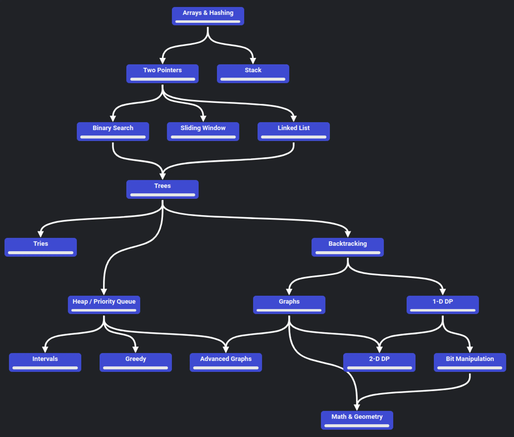

# 🧠 NeetCode 150 – Java Solutions

Welcome to my Java-based NeetCode 150 problem-solving repository. This project contains structured, modular solutions designed to improve problem-solving skills and crack technical interviews at top tech companies.

---

## 📦 Package Structure

The root package is:

```
problem.solving.neetcode150
```

Within it, each problem is implemented as a **category** (Java package) containing:

```
/<category>/
└── problems/
    ├── <ProblemName>.java      # Java implementation
    └── metadata/
        ├── problem-statement   # Original or custom problem description
        └── solutions           # Alternative approaches or written explanations
```

## Roadmap


---

## 🔍 Category Tracker

- [x] Arrays & Hashing
- [ ] Two Pointers
- [ ] Sliding Window
- [ ] Stack
- [ ] Binary Search
- [ ] Trees
- [ ] Graphs
- [ ] Dynamic Programming
- [ ] Intervals
- [ ] Heap / Priority Queue
- [ ] Backtracking
- [ ] Math & Geometry
- [ ] Bit Manipulation
- [ ] Advanced Graphs
- [ ] 1D/2D DP


## 🤝 Contributions

This is a self-paced personal project maintained by **Suman Kumarajothi**.  
Feel free to fork it for your own use or open suggestions if you'd like to collaborate.

---

## 🔗 Useful Links

- [NeetCode 150 Problem List](https://neetcode.io/practice)
- [LeetCode](https://leetcode.com/)
- [NeetCode GitHub](https://github.com/neetcode-gh)

---

Happy coding and good luck on your interview journey! 💪✨
